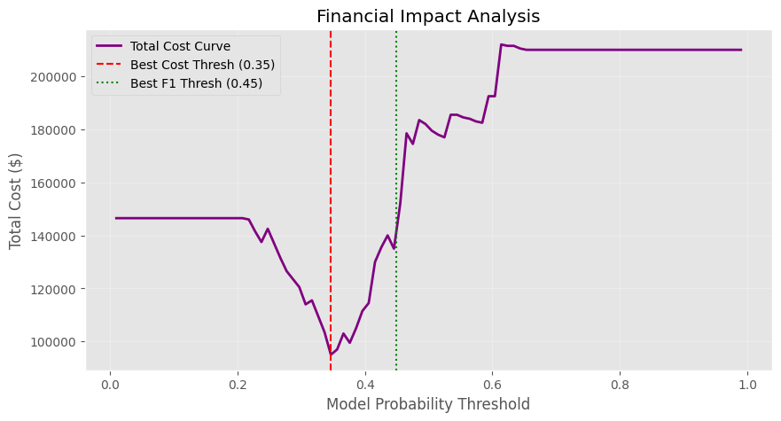
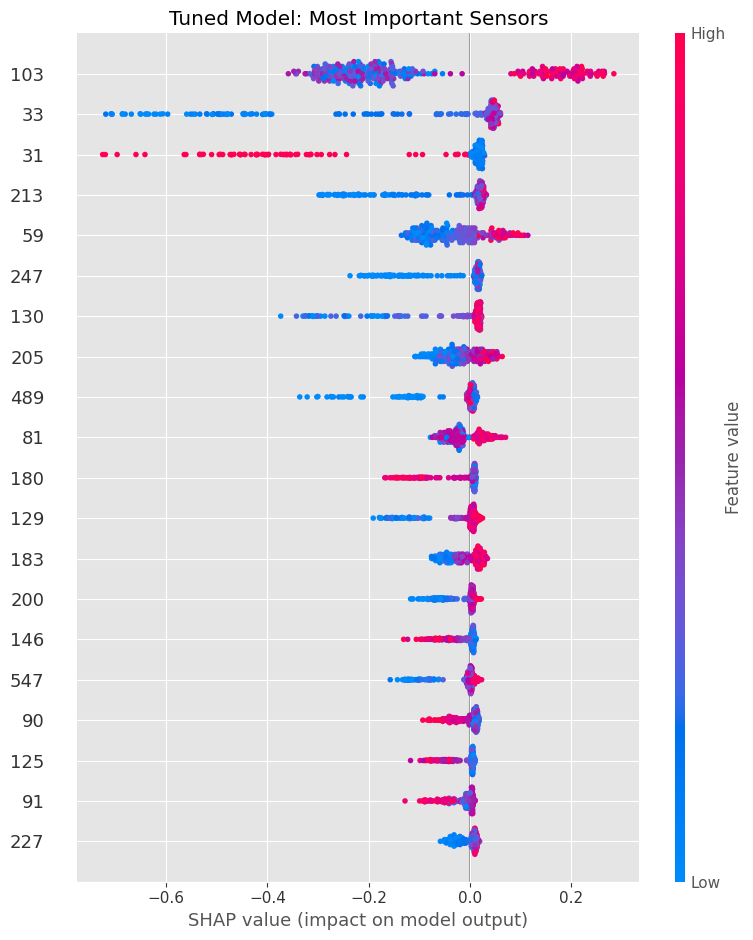
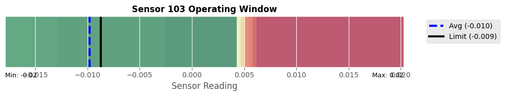

# Semiconductor Yield Optimization & Root Cause Analysis
### Determining Critical Sensor Limits for Semiconductor Batch Success

## Summary
In semiconductor manufacturing, scrap batches are incredibly costly. Traditional Statistical Process Control (SPC) often misses complex, multivariate interactions that lead to defects.
To solve this, this project developed a machine learning pipeline to:
1.  **Predict Failures:** Identifying **48% of yield excursions** that were previously missed by standard controls.
2.  **Optimize Business Value:** Tuned the model based on financial impact (Cost of Scrap vs. Cost of Inspection) rather than just raw accuracy.
3.  **Define Control Limits:** Used interpretability techniques to propose actionable changes similar to SPC.

For further visualization, the code from the notebook has been implemented to generate a process dashboard in Streamlit, which simulates live inference on process data for predicting real time yield status. The link to the dashboard can be viewed here: https://secom-dash.streamlit.app/ 

---

## The Business Problem
* **The Data:** UCI SECOM Dataset (Semiconductor Manufacturing). 590 sensors, ~1500 batches.
* **The Challenge:**
    * **Extreme Class Imbalance:** Failures are rare (~6%), making standard models biased toward "Pass."
    * **High Dimensionality & Noise:** Hundreds of redundant sensors.
    * **Cost Asymmetry (simulated):** A missed failure (False Negative) costs **$10,000**, while a false alarm (False Positive) costs only **$500**.

---

## Code Structure

### 1: Preprocessing/Cleaning
Raw sensor data is rarely model-ready, so I implemented a robust preprocessing pipeline:
* **Variance Thresholding:** Removed 100+ "dead" sensors (zero variance).
* **Multicollinearity Filter:** Dropped redundant features ($r > 0.95$) to reduce noise.
* **KNN Imputation:** Used K-Nearest Neighbors to fill missing data, preserving the physical correlation structure between sensors (e.g., Temp/Pressure relationships).

### 2: Cost-Sensitive Modeling
I trained an **XGBoost Classifier** specifically tuned for imbalance:
* **Class Weights:** Applied `scale_pos_weight` to heavily penalize missed failures.
* **Hyperparameter Tuning:** Used `RandomizedSearchCV` to optimize tree depth and learning rate.
* **Performance:**
    * **ROC-AUC:** Improved from 0.50 (Baseline) to **0.733** (Tuned).
    * **Recall:** The final model captures **48%** of all defects.

### 3: Financial Optimization
A standard threshold of 0.50 for this is suboptimal for higher stakes environments (like manufacturing) where the functional cost of a false negative is much more than a false positive. To account for this, I optimized the model with financial weighting:

* **F1-Score Threshold:** 0.45.
* **Minimum Cost Threshold:** **0.35**.
* **Decision:** We selected the **0.35** threshold. While this increases the risk false alarms, it minimizes total financial loss by catching the most expensive scrap events.

### 4. Engineering Insights (Root Cause Analysis)
Using **SHAP (SHapley Additive exPlanations)**, we identified **Sensor 103** as the #1 predictor of failure.

### 5. Virtual Metrology
To make this actionable, I used **Partial Dependence Plots (PDP)** to define the "Safe Operating Window" for Sensor 103 (based on the SHAP findings).

* **Observation:** The process is stable when Sensor 103 reads below **-0.012**.
* **Risk Spike:** Failure probability doubles immediately when the value crosses **-0.009**.
* **Recommendation:** Tighten the Upper Control Limit (UCL) for Sensor 103 to **-0.012**.

---

## Results and Evaluations
This project moves beyond "black box" prediction to provide transparent engineering solutions. By implementing the recommended control limit on Sensor 103 and using the cost-optimized detection model, the manufacturing process can significantly reduce scrap rates, translating to estimated savings of **$50,000 - $100,000 per year** (based on projected scrap reduction).

---
## Future Steps
- Consider extension of this dataset using synthetic data generation for training new models
- Use a simpler tree based model to create interpretable procedural documents in a flowchart/tree for operators
- Utilize a constrained VAE to develop a more balanced dataset for training
